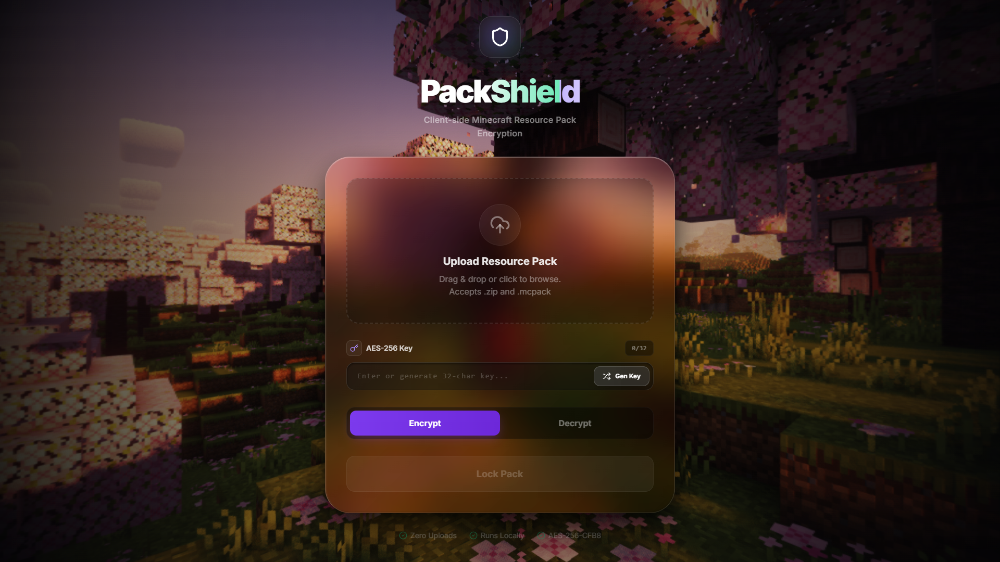

<div align="center">

# 🛡️ PackShield

**Blazing-fast, zero-backend encryption for Minecraft resource packs**  
<sub>Secure • Private • Fully client-side</sub>

<br/>

[](https://your-demo-link.com)
[](https://github.com/exocubeyt/packshield)
[](https://github.com/exocubeyt/packshield/blob/main/LICENSE)

<br/>


</div>

---

## 🎬 Preview



---

## 🚀 Overview

**PackShield** is a high-performance, browser-based utility for encrypting and decrypting **Minecraft Bedrock Edition** resource packs (`.mcpack` / `.zip`).

No CLI tools. No uploads. No shady services.

Everything runs **locally in your browser**, powered by a custom **WebAssembly crypto engine built with Go**.

---

## ✨ Features

- 🔒 **100% Private**  
  No servers, no uploads — your files never leave your device.

- ⚡ **WASM-Powered Performance**  
  Smooth handling of large HD packs without freezing.

- 🧠 **AES-256-CFB8 Encryption**  
  Matches Minecraft Bedrock’s native encryption standard.

- 🎨 **Modern UI/UX**  
  Glassmorphism-inspired design with fluid interactions.

---

## 🛠️ Tech Stack

| Layer        | Technology |
|--------------|-----------|
| **Frontend** | React 18, Vite, TailwindCSS v3 |
| **Engine**   | Go (compiled to WebAssembly) |
| **Processing** | Web Workers (multi-threaded) |

---

## ⚡ Quick Start

### 📦 Prerequisites

- Node.js (v18+)
- Go (v1.22+)

---

### 🔧 Setup

#### 1. Clone the repository
```bash
git clone https://github.com/exocubeyt/packshield.git
cd packshield
```

#### 2. Install dependencies
```bash
npm install
```

#### 3. Build the WebAssembly engine

**Windows**
```powershell
powershell -ExecutionPolicy Bypass -File .\build_wasm.ps1
```

**Linux / macOS**
```bash
./build_wasm.sh
```

#### 4. Start development server
```bash
npm run dev
```

Open the local URL shown in your terminal — you're ready to go.

---

## 🔐 Security

- Encryption keys are generated locally using:
  ```js
  crypto.getRandomValues()
  ```
- No keys or files are stored, logged, or transmitted.

> ⚠️ **Important:**  
> Lost your key? It **cannot be recovered**.

---

## 📌 Roadmap

- [ ] Drag & drop UI improvements  
- [ ] Batch encryption support  
- [ ] Dark/light theme toggle  
- [ ] Progress indicators for large packs  

---

## 🤝 Contributing

Contributions are welcome!

1. Fork the repo  
2. Create a new branch  
3. Make your changes  
4. Submit a pull request  

---

## 🌟 Support

If you like this project, consider giving it a ⭐  
It helps more than you think.

---

## 📜 License

This project is licensed under the GPL 3.0 License.  
See the `LICENSE` file for details.
